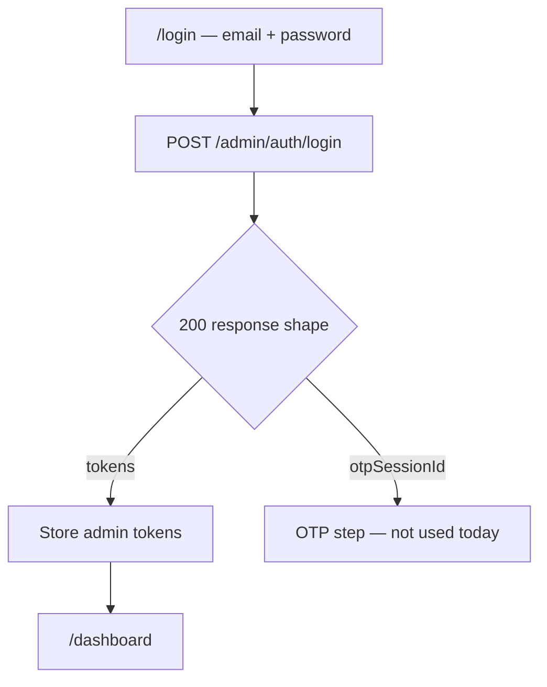

# Frontend implementation guide — admin dashboard auth

> **Audience:** AI agents and engineers working in the **`asset-union-admin`** repo (Next.js App Router + Tailwind).  
> **Backend repo:** `asset-union-backend` — API contract below is authoritative.  
> **Goal:** Email + password sign-in that lands on the admin dashboard immediately (no OTP step in current deployment).

---

## 0) Mandatory preflight

Before changing admin auth in `asset-union-admin`:

1. Read this document end-to-end.
2. Skim `docs/UI_TO_API_INVENTORY.md` (Admin auth) in **asset-union-backend**.
3. Inspect existing admin login, middleware, and API client — extend; do not add a parallel auth stack.
4. Confirm `NEXT_PUBLIC_API_URL` (e.g. `http://localhost:8000/v1`).

**Hard rules (current deployment):**

- Admin login is **email + password only** — **no OTP screen**.
- On successful login, store tokens and **`router.replace("/dashboard")`** (or home admin route).
- Do **not** call `/admin/auth/login/otp/verify` unless product explicitly enables OTP (see §7).
- Use **admin** tokens for admin routes (`adminAccessToken`), separate from investor app tokens.

---

## 1) User journey (default — OTP disabled)



| Step | UI | API |
| --- | --- | --- |
| 1 | Login form | `POST /v1/admin/auth/login` |
| 2 | Dashboard | Admin APIs with Bearer token |
| Session | App load / refresh | `GET /v1/admin/auth/me`, `POST /v1/admin/auth/refresh` |
| Logout | User action | `POST /v1/admin/auth/logout` |

---

## 2) API contract

Base URL: `{NEXT_PUBLIC_API_URL}` (include `/v1`).

### 2.1 Login (password-only — default)

```
POST /v1/admin/auth/login
Content-Type: application/json

{
  "email": "admin@assetunion.com",
  "password": "AdminPassword123!"
}
```

**200 (default — `ADMIN_LOGIN_OTP_ENABLED=false`):**

```json
{
  "accessToken": "...",
  "refreshToken": "...",
  "expiresAt": 1700000000,
  "admin": {
    "id": "...",
    "email": "admin@assetunion.com",
    "fullName": "Super Admin",
    "roles": ["super_admin"]
  }
}
```

**After success:**

1. Persist `accessToken` + `refreshToken` (httpOnly cookies recommended).
2. Store `admin` in auth context (id, email, fullName, roles).
3. **`router.replace("/dashboard")`** — no intermediate OTP page.

**Errors:**

| Code                  | HTTP | UI action                                |
| --------------------- | ---- | ---------------------------------------- |
| `INVALID_CREDENTIALS` | 401  | Show generic “Invalid email or password” |
| `ACCOUNT_SUSPENDED`   | 403  | Show suspended message                   |
| `ACCOUNT_LOCKED`      | 403  | Show locked / try later message          |
| `VALIDATION_ERROR`    | 400  | Show field errors                        |

---

### 2.2 Get current admin

```
GET /v1/admin/auth/me
Authorization: Bearer <adminAccessToken>
```

**200:**

```json
{
  "id": "...",
  "email": "admin@assetunion.com",
  "fullName": "Super Admin",
  "roles": ["super_admin"]
}
```

Use on app bootstrap and after refresh.

---

### 2.3 Refresh token

```
POST /v1/admin/auth/refresh
Content-Type: application/json

{ "refreshToken": "..." }
```

**200:** Same shape as login (`accessToken`, `refreshToken`, `expiresAt`, `admin`).

---

### 2.4 Logout

```
POST /v1/admin/auth/logout
Authorization: Bearer <adminAccessToken>
Content-Type: application/json

{ "refreshToken": "..." }
```

**200:** `{ "success": true }`

Clear client session and redirect to `/login`.

---

## 3) TypeScript types

```typescript
export type AdminRole =
  | "super_admin"
  | "property_manager"
  | "user_manager"
  | "rent_manager";

export type AdminUser = {
  id: string;
  email: string;
  fullName: string;
  roles: AdminRole[];
};

export type AdminLoginRequest = {
  email: string;
  password: string;
};

export type AdminTokenResponse = {
  accessToken: string;
  refreshToken: string;
  expiresAt: number;
  admin: AdminUser;
};

/** Present only when backend OTP mode is enabled (not used in default UI) */
export type OtpSendResponse = {
  otpSessionId: string;
  expiresAt: number;
  maskedEmail: string;
  isExistingUser: boolean;
};
```

---

## 4) Login response handling

The login endpoint may return **either** tokens or an OTP session depending on backend config. **Default UI assumes tokens only.**

```typescript
async function adminLogin(
  credentials: AdminLoginRequest,
): Promise<AdminTokenResponse> {
  const res = await api.post("/admin/auth/login", credentials);

  if ("accessToken" in res) {
    return res as AdminTokenResponse;
  }

  // OTP mode — not implemented in admin UI yet
  throw new Error(
    "Admin OTP login is not enabled in the UI. Contact platform team.",
  );
}
```

Optional future-proof check:

```typescript
function isAdminTokenResponse(body: unknown): body is AdminTokenResponse {
  return (
    typeof body === "object" &&
    body !== null &&
    "accessToken" in body &&
    "admin" in body
  );
}
```

---

## 5) Route structure (Next.js App Router)

```
app/
  (auth)/
    login/page.tsx          # email + password → POST login → dashboard
  (admin)/
    dashboard/...           # protected admin shell
  middleware.ts
```

| Route | Auth | Action |
| --- | --- | --- |
| `/login` | Public | Login form; redirect to dashboard if already authenticated |
| `/dashboard/**` | Admin token required | Main admin app |

**No** `/login/verify-otp` route in the default implementation.

---

## 6) Middleware

1. **No admin token** + `/dashboard/**` → redirect `/login?callbackUrl=...`
2. **Valid admin token** + `/login` → redirect `/dashboard`
3. Attach `Authorization: Bearer <adminAccessToken>` on all `/v1/admin/**` API calls (not investor `/v1/auth/**`).

Role-based UI (optional): read `admin.roles` from `/me` to show/hide nav items. Server-side admin routes already enforce roles via `authenticateAdminRoute`.

---

## 7) OTP mode (future — do not build unless enabled)

Backend flag: `ADMIN_LOGIN_OTP_ENABLED=true` in `apps/server/.env`.

When enabled, `POST /admin/auth/login` returns **OTP session** (not tokens):

```json
{
  "otpSessionId": "...",
  "expiresAt": 1700000000,
  "maskedEmail": "a***@assetunion.com",
  "isExistingUser": true
}
```

Then `POST /admin/auth/login/otp/verify` with `{ otpSessionId, code }` returns tokens.

**Until product enables this flag, remove or hide any admin OTP UI** left from earlier designs.

---

## 8) Login page spec

- Fields: **email**, **password** (with show/hide toggle).
- Submit → loading state → on success navigate to **`/dashboard`**.
- Show backend error messages per §2.1 table.
- Link “Forgot password?” only if a backend endpoint exists (not implemented yet).
- Match existing Tailwind / design system for admin brand.

**Local seed credentials** (after `pnpm db:seed`):

- Email: `admin@assetunion.com`
- Password: `AdminPassword123!`

---

## 9) Auth context

Provide `AdminAuthProvider`:

- `admin: AdminUser | null`
- `login(email, password)` → stores tokens + admin → redirect dashboard
- `logout()` → clears session → redirect login
- `refreshSession()` → `POST /admin/auth/refresh` + `GET /admin/auth/me`
- Separate storage keys from investor app (`adminAccessToken`, not `accessToken`)

---

## 10) Remove / update legacy UI

If the admin app has:

- OTP verify step after login → **remove** for default deployment
- Two-step login (password then OTP) → collapse to single step
- Calls that expect `otpSessionId` from login → update to expect tokens directly
- Shared auth with investor app → **split**; admin uses `/v1/admin/auth/*` only

---

## 11) Testing checklist

- [ ] Valid credentials → 200 with tokens → lands on `/dashboard`
- [ ] Invalid password → 401, stay on login
- [ ] Suspended / locked account → 403 with message
- [ ] Direct `/dashboard` without token → redirect login
- [ ] `/login` while authenticated → redirect dashboard
- [ ] `GET /admin/auth/me` returns roles
- [ ] Logout clears session
- [ ] Refresh rotates tokens and preserves session
- [ ] Admin API calls use admin Bearer token (not investor token)

---

## 12) Environment

**Backend** (`apps/server/.env`):

```env
ADMIN_LOGIN_OTP_ENABLED=false
JWT_SECRET=...
CORS_ORIGIN=http://localhost:3001  # admin app origin
```

**Frontend** (`asset-union-admin`):

```env
NEXT_PUBLIC_API_URL=http://localhost:8000/v1
```

---

## 13) Backend reference

| Topic | Path |
| --- | --- |
| Admin routes | `packages/api/src/http/v1/auth/auth.routes.ts` |
| Login handler | `packages/api/src/http/v1/auth/auth.controller.ts` (`adminLogin`) |
| Auth service | `packages/api/src/services/auth/auth.service.ts` (`loginAdmin`) |
| Admin middleware | `packages/api/src/shared/middleware/auth.ts` (`authenticateAdminRoute`) |
| Postman | `postman/Asset_Union_API_Collection.json` → Admin Login |

---

## 14) Agent execution summary

1. Single-page login: email + password.
2. `POST /v1/admin/auth/login` → expect **token response** → save → redirect **`/dashboard`**.
3. No OTP verify route or UI in default build.
4. Wire middleware + admin auth context per §5–§6.
5. Remove stale OTP admin login flow if present.
6. Run §11 checklist.

**Done when:** Admin can sign in with password and reach the dashboard in one step; no OTP dependency when `ADMIN_LOGIN_OTP_ENABLED=false`.
