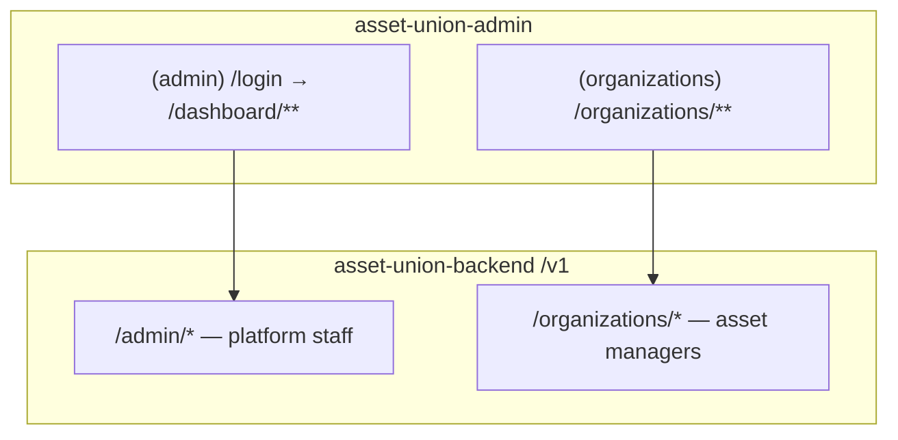
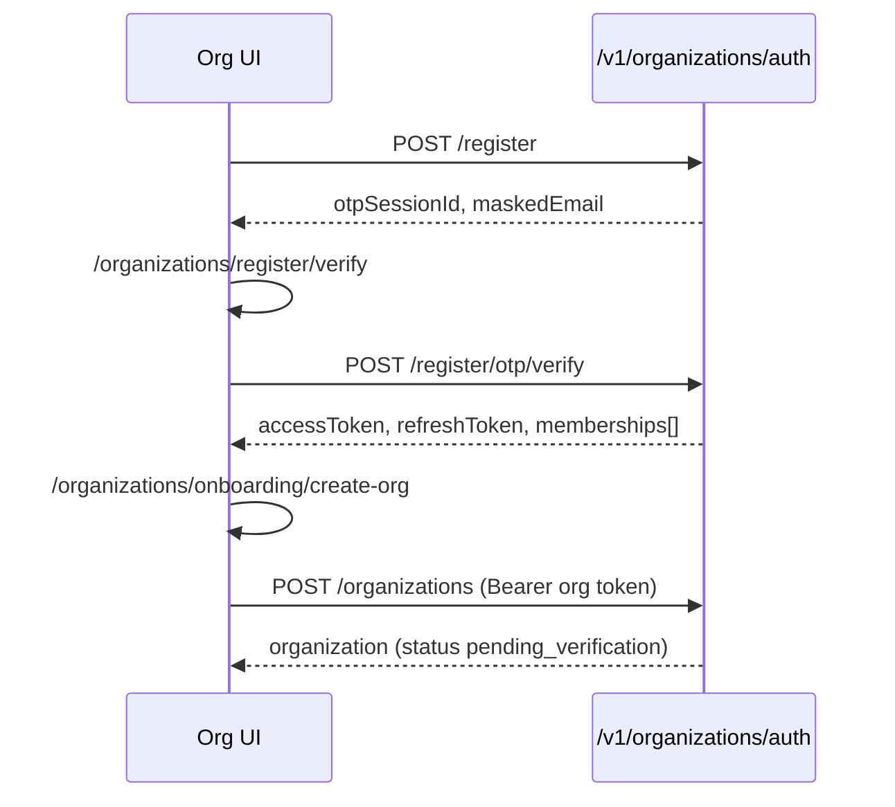
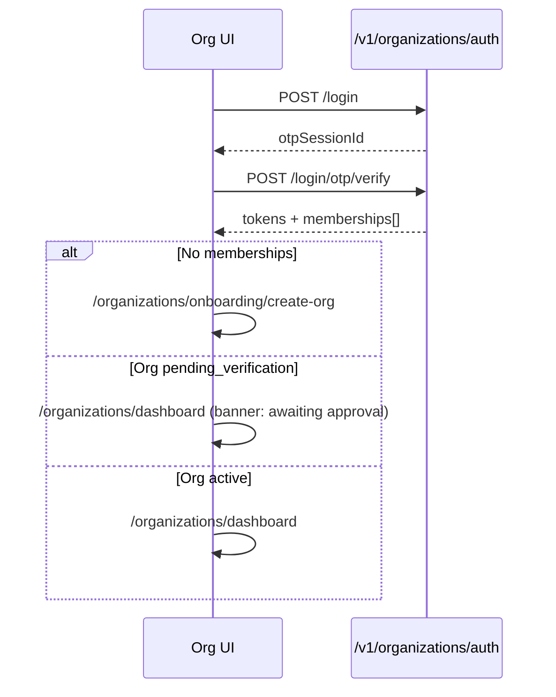
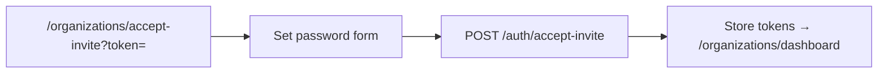
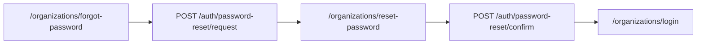

# Frontend implementation guide — organization portal (asset managers)

> **Category:** [`docs/frontend/`](../README.md#frontend--admin-integration)  
> **Audience:** AI agents and engineers working in **`asset-union-admin`** (Next.js App Router).  
> **Backend repo:** `asset-union-backend` — API contract below is authoritative.  
> **Prerequisite:** [FRONTEND_ADMIN_AUTH.md](./FRONTEND_ADMIN_AUTH.md) for **platform admin** (`/v1/admin/*`). This doc covers the **organization** surface only.  
> **Related:** [FRONTEND_ADMIN_PROPERTY_WIZARD.md](./FRONTEND_ADMIN_PROPERTY_WIZARD.md) — same wizard shapes; org routes use `/v1/organizations/properties/*` instead of `/v1/admin/properties/*`.

---

## 0) Mandatory preflight

Before building organization UI in `asset-union-admin`:

1. Read this document end-to-end.
2. Read [FRONTEND_ADMIN_AUTH.md](./FRONTEND_ADMIN_AUTH.md) — **do not mix** admin and organization tokens.
3. Confirm `NEXT_PUBLIC_API_URL` includes `/v1` (e.g. `http://localhost:8000/v1`).
4. Set `ORGANIZATION_PORTAL_URL` on the API (see §12) so invite emails point at your org routes.

**Hard rules:**

| Rule | Detail |
| --- | --- |
| Separate auth namespace | Organization JWT audience is `asset-union-organizations`. Use **`organizationAccessToken`**, not `adminAccessToken`. |
| Separate route group | Mount org UI under **`/organizations/**`**, not `/dashboard/\*\*`. |
| Password + OTP always | Register and login are **two steps**: credentials → OTP verify → tokens. |
| Org context header | After login, send **`X-Organization-Id: <uuid>`** on org-scoped routes when the user has multiple memberships (optional if only one). |
| Active org gate | Members, properties, and compliance require org `status === "active"`. Profile (`GET/PATCH /organizations/me`) works while `pending_verification`. |

---

## 1) Two surfaces in one Next.js app

Use **one repo** (`asset-union-admin`) with **two App Router segments** and **two API clients** (or one client with explicit token + path prefix).



| Surface | Who | Base path (UI) | API prefix | Token |
| --- | --- | --- | --- | --- |
| Platform admin | `super_admin`, `property_manager`, etc. | `/dashboard`, `/property-management`, … | `/v1/admin/**` | Admin access token |
| Organization portal | Developers, agencies, brokers, invited staff | `/organizations/**` | `/v1/organizations/**` | Organization access token |

**Do not** reuse admin middleware for `/organizations/**` or call `/v1/admin/properties` from the org portal (org listings are scoped server-side to the member’s org).

---

## 2) User journeys (auth → onboarding → app)

### 2.1 Registration (new organization owner)



### 2.2 Login (existing user)



### 2.3 Invite accept (invited member)

Email link format (backend builds from `ORGANIZATION_PORTAL_URL`):

```
{ORGANIZATION_PORTAL_URL}/organizations/accept-invite?token=<hex>
```



Invited users have `pending_email_verification` until accept; they **cannot** use normal login until the invite is accepted.

### 2.4 Forgot password



`password-reset/request` always returns a **generic success message** when the email is unknown (no account enumeration).

---

## 3) Next.js route structure

Recommended App Router layout:

```
app/
  (admin)/                          # Platform admin — existing
    login/page.tsx
    dashboard/...
    property-management/...
  (organizations)/                  # Organization portal — NEW
    layout.tsx                      # Org shell: sidebar, org switcher
    login/page.tsx
    register/page.tsx
    register/verify/page.tsx        # OTP after register
    forgot-password/page.tsx
    reset-password/page.tsx         # OTP + new password
    accept-invite/page.tsx          # Public; reads ?token=
    onboarding/
      create-org/page.tsx           # POST /organizations
      profile/page.tsx              # PATCH /organizations/me (images, legal)
    dashboard/page.tsx
    members/page.tsx
    properties/
      page.tsx                      # List
      new/page.tsx                  # Wizard create
      [id]/page.tsx                 # Wizard edit + submit
    compliance/page.tsx
  middleware.ts                     # Split guards by path prefix
```

### 3.1 Public org routes

| Route                            | Purpose                                |
| -------------------------------- | -------------------------------------- |
| `/organizations/login`           | Email + password → OTP step            |
| `/organizations/login/verify`    | 6-digit OTP → tokens                   |
| `/organizations/register`        | Sign up → OTP                          |
| `/organizations/register/verify` | OTP → tokens (memberships often empty) |
| `/organizations/forgot-password` | Request reset OTP                      |
| `/organizations/reset-password`  | Confirm OTP + new password             |
| `/organizations/accept-invite`   | Token from email + password            |

### 3.2 Protected org routes

| Route | Min role | Org must be `active`? |
| --- | --- | --- |
| `/organizations/onboarding/create-org` | Authenticated org user | No |
| `/organizations/onboarding/profile` | `organization_owner` or `organization_admin` | No (`pending_verification` OK) |
| `/organizations/dashboard` | Any member | No (read-only / banner if not active) |
| `/organizations/members` | `organization_owner`, `organization_admin` | **Yes** |
| `/organizations/properties/**` | See §8 | **Yes** |
| `/organizations/compliance` | Any member | **Yes** |

---

## 4) Middleware and session storage

### 4.1 Cookie / storage keys (suggested)

Keep **separate** from admin session:

| Key | Content |
| --- | --- |
| `org_access_token` | Organization JWT |
| `org_refresh_token` | Refresh token |
| `org_user` | `{ id, email, fullName, status }` |
| `org_memberships` | `{ organizationId, organizationName, role }[]` |
| `org_active_id` | Selected `organizationId` (mirrors `X-Organization-Id`) |

### 4.2 Middleware rules

```typescript
// Pseudocode — adapt to your middleware.ts
const isOrgPath = pathname.startsWith("/organizations");
const isOrgPublic =
  pathname.startsWith("/organizations/login") ||
  pathname.startsWith("/organizations/register") ||
  pathname.startsWith("/organizations/forgot-password") ||
  pathname.startsWith("/organizations/reset-password") ||
  pathname.startsWith("/organizations/accept-invite");

if (isOrgPath && !isOrgPublic && !orgAccessToken) {
  redirect(`/organizations/login?callbackUrl=${pathname}`);
}

if (isOrgPath && isOrgPublic && orgAccessToken) {
  redirect("/organizations/dashboard");
}

// Platform admin rules unchanged — /dashboard/** uses adminAccessToken
```

### 4.3 API client

```typescript
// Organization API calls only
headers: {
  Authorization: `Bearer ${orgAccessToken}`,
  ...(activeOrganizationId && {
    "X-Organization-Id": activeOrganizationId,
  }),
}
```

- Base: `${NEXT_PUBLIC_API_URL}/organizations/...`
- Never attach org token to `/admin/**` or investor `/auth/**`.

### 4.4 Bootstrap guard (client layout)

On org app load:

1. `GET /v1/organizations/auth/me` — refresh user + memberships.
2. If `memberships.length === 0` → redirect `/organizations/onboarding/create-org`.
3. If no `org_active_id` → default to first membership.
4. `GET /v1/organizations/me` — load org profile + `status`.
5. If route requires active org and `status !== "active"` → show **pending / suspended** page or banner (do not call members/properties APIs; they return `403` `ORGANIZATION_NOT_ACTIVE`).

---

## 5) API contract — authentication

Base: `{NEXT_PUBLIC_API_URL}` (must include `/v1`).

All paths below are relative to **`/organizations/auth`**.

### 5.1 Register

```
POST /v1/organizations/auth/register
Content-Type: application/json

{
  "email": "owner@developer.com",
  "password": "SecurePass123!",
  "fullName": "Alex Owner"
}
```

**200:**

```json
{
  "otpSessionId": "...",
  "expiresAt": 1700000000,
  "maskedEmail": "a***@developer.com",
  "isExistingUser": false
}
```

**409** `EMAIL_ALREADY_REGISTERED` — use login or accept-invite.

---

### 5.2 Register — verify OTP

```
POST /v1/organizations/auth/register/otp/verify

{ "otpSessionId": "...", "code": "123456" }
```

**200:** `OrganizationTokenResponse` (see §5.9).

---

### 5.3 Login

```
POST /v1/organizations/auth/login

{ "email": "...", "password": "..." }
```

**200:** OTP session (same shape as §5.1).

| Code                  | HTTP | UI                                          |
| --------------------- | ---- | ------------------------------------------- |
| `INVALID_CREDENTIALS` | 401  | Generic error                               |
| `ACCOUNT_LOCKED`      | 403  | Try later (5 failed attempts → 15 min lock) |
| `ACCOUNT_SUSPENDED`   | 403  | Contact support                             |
| `OTP_RATE_LIMITED`    | 429  | Back off                                    |

---

### 5.4 Login — verify OTP

```
POST /v1/organizations/auth/login/otp/verify

{ "otpSessionId": "...", "code": "123456" }
```

**200:** `OrganizationTokenResponse`.

---

### 5.5 Accept invite

```
POST /v1/organizations/auth/accept-invite

{
  "token": "<from query string>",
  "password": "SecurePass123!"
}
```

**200:** `OrganizationTokenResponse` — user is logged in; go to dashboard.

| Code                    | HTTP | UI                                   |
| ----------------------- | ---- | ------------------------------------ |
| `INVITE_INVALID`        | 410  | Link expired; ask admin to re-invite |
| `INVITE_EMAIL_MISMATCH` | 400  | Rare; show support message           |

---

### 5.6 Forgot password — request

```
POST /v1/organizations/auth/password-reset/request

{ "email": "owner@developer.com" }
```

**200 (email unknown):**

```json
{
  "message": "If an account exists with this email, a reset code has been sent."
}
```

**200 (email found):** OTP session object (§5.1).

---

### 5.7 Forgot password — confirm

```
POST /v1/organizations/auth/password-reset/confirm

{
  "otpSessionId": "...",
  "code": "123456",
  "password": "NewSecurePass123!"
}
```

**200:** `{ "success": true }` → redirect to login.

---

### 5.8 Session maintenance

| Action | Method | Path | Auth |
| --- | --- | --- | --- |
| Current user + memberships | `GET` | `/v1/organizations/auth/me` | Bearer org token |
| Refresh | `POST` | `/v1/organizations/auth/refresh` | Body: `{ "refreshToken" }` |
| Logout | `POST` | `/v1/organizations/auth/logout` | Bearer + optional `refreshToken` |

**Logout 200:** `{ "success": true }` — clear org cookies; redirect `/organizations/login`.

---

### 5.9 Token response shape

```typescript
export type OrganizationMemberRole =
  | "organization_owner"
  | "organization_admin"
  | "asset_manager"
  | "viewer";

export type OrganizationMembership = {
  organizationId: string;
  organizationName: string;
  role: OrganizationMemberRole;
};

export type OrganizationTokenResponse = {
  accessToken: string;
  refreshToken: string;
  expiresAt: number; // Unix seconds
  user: {
    id: string;
    email: string;
    fullName: string;
    status: "active" | "suspended" | "pending_email_verification";
  };
  memberships: OrganizationMembership[];
};
```

---

## 6) API contract — organization profile & onboarding

Requires **Bearer organization token**. Org-scoped routes also need membership (middleware resolves org via `X-Organization-Id` or first membership).

### 6.1 Create organization (first-time owner)

```
POST /v1/organizations
Authorization: Bearer <orgAccessToken>
```

**Body (required fields):**

```json
{
  "name": "Acme Development",
  "shortDescription": "Residential developer in UAE.",
  "country": "AE",
  "type": "developer",
  "profileImageUrl": "https://...",
  "profileImageStorageKey": "orgs/.../profile.jpg",
  "heroImageUrl": "https://...",
  "heroImageStorageKey": "orgs/.../hero.jpg",
  "legalName": "Acme Development LLC",
  "website": "https://acme.dev",
  "contactEmail": "contact@acme.dev",
  "contactPhone": "+971...",
  "address": "Dubai, UAE",
  "registrationNumber": "REG-123"
}
```

**`type` enum:** `developer` | `agency` | `broker` | `partner` | `other`

**`country`:** ISO 3166-1 alpha-2 from accepted list (see §12).

**201:** Organization object (`status` is **`pending_verification`** until platform admin activates).

**409** `ORGANIZATION_ALREADY_EXISTS` — user already owns an org; go to dashboard.

**Onboarding complete (backend):** `onboardingCompletedAt` set when **all** of: `name`, `shortDescription`, `country`, `type`, `profileImageUrl`, `heroImageUrl` are non-empty. UI should treat missing images as blocking before “submit for review” messaging.

---

### 6.2 Get organization profile

```
GET /v1/organizations/me
Authorization: Bearer <orgAccessToken>
X-Organization-Id: <uuid>   # optional if single membership
```

**Roles:** all member roles.

**200:**

```json
{
  "id": "...",
  "slug": "acme-development",
  "name": "Acme Development",
  "shortDescription": "...",
  "profileImageUrl": "...",
  "heroImageUrl": "...",
  "country": "AE",
  "type": "developer",
  "status": "pending_verification",
  "onboardingCompletedAt": 1700000000,
  "legalName": "...",
  "website": "...",
  "contactEmail": "...",
  "contactPhone": "...",
  "address": "...",
  "registrationNumber": "...",
  "createdAt": 1700000000,
  "updatedAt": 1700000000
}
```

**Org `status` values:**

| Status | Meaning | UI |
| --- | --- | --- |
| `pending_verification` | Awaiting platform approval | Banner; allow profile edit; **hide** members/properties nav actions |
| `active` | Approved | Full sidebar |
| `suspended` | Blocked by platform | Read-only message; contact support |

---

### 6.3 Update organization profile

```
PATCH /v1/organizations/me
Authorization: Bearer <orgAccessToken>
```

**Roles:** `organization_owner`, `organization_admin` only.

**Body:** partial fields from create (all optional). Use `null` to clear nullable strings/images.

**200:** Updated organization object.

Works while `pending_verification` — use for onboarding profile step.

---

## 7) Sidebar and navigation (organization shell)

Suggested sidebar items and visibility:

| Nav label | Route | Roles | Requires `active` org |
| --- | --- | --- | --- |
| Dashboard | `/organizations/dashboard` | All | No |
| Organization profile | `/organizations/onboarding/profile` or `/organizations/settings` | Owner, Admin | No |
| Team | `/organizations/members` | Owner, Admin | **Yes** |
| Properties | `/organizations/properties` | All (write: see §8) | **Yes** |
| Compliance log | `/organizations/compliance` | All | **Yes** |
| Sign out | — | All | — |

**Org switcher** (header): if `memberships.length > 1`, set `org_active_id` + `X-Organization-Id` and refetch `/organizations/me`.

**Platform admin link** (optional footer): “Platform admin” → `/dashboard` only if user also has admin account (separate login); do not assume single sign-on.

---

## 8) API contract — members

Requires **active** organization (`403` `ORGANIZATION_NOT_ACTIVE` otherwise).

### 8.1 List members

```
GET /v1/organizations/members
```

**Roles:** all members (read).

**200:**

```json
{
  "items": [
    {
      "id": "member-uuid",
      "organizationUserId": "user-uuid",
      "email": "manager@acme.dev",
      "fullName": "Sam Manager",
      "role": "asset_manager",
      "joinedAt": 1700000000
    }
  ]
}
```

### 8.2 Invite member

```
POST /v1/organizations/members

{
  "email": "new@acme.dev",
  "fullName": "New Hire",
  "role": "asset_manager"
}
```

**Roles:** `organization_owner`, `organization_admin`.

**201:** `{ "id": "member-uuid" }`

| Code                        | HTTP | UI                 |
| --------------------------- | ---- | ------------------ |
| `ORGANIZATION_MEMBER_LIMIT` | 409  | Max **10** members |
| `MEMBER_ALREADY_EXISTS`     | 400  | Already on team    |

**Side effect:** new users receive invite email (`organization.member_invite`) with link to `/organizations/accept-invite?token=...`. Active existing users are added without email.

### 8.3 Update role / remove

```
PATCH /v1/organizations/members/:memberId
{ "role": "viewer" }

DELETE /v1/organizations/members/:memberId
```

**Roles:** owner, admin. Cannot demote/remove **owner** (`CANNOT_CHANGE_OWNER`, `CANNOT_REMOVE_OWNER`).

---

## 9) API contract — properties (organization-scoped)

**Requires active org.** Wizard request/response shapes match [FRONTEND_ADMIN_PROPERTY_WIZARD.md](./FRONTEND_ADMIN_PROPERTY_WIZARD.md); replace path prefix:

| Admin path | Organization path |
| --- | --- |
| `GET /v1/admin/properties` | `GET /v1/organizations/properties` |
| `POST /v1/admin/properties` | `POST /v1/organizations/properties` |
| `GET /v1/admin/properties/:id` | `GET /v1/organizations/properties/:id` |
| `PUT /v1/admin/properties/:id` | `PUT /v1/organizations/properties/:id` |
| `POST /v1/admin/properties/:id/submit` | `POST /v1/organizations/properties/:id/submit` |
| `POST /v1/admin/properties/:id/documents` | `POST /v1/organizations/properties/:id/documents` |
| `DELETE /v1/admin/properties/:id/documents/:documentId` | `DELETE /v1/organizations/properties/:id/documents/:documentId` |

**List query:** `?status=draft|submitted|active|...&limit=&offset=`

**List item shape:**

```json
{
  "items": [
    {
      "id": "...",
      "propertyName": "...",
      "location": "...",
      "currentStage": "draft",
      "funding": "0",
      "fundingPercent": 0,
      "type": "rental",
      "date": 1700000000,
      "status": "draft"
    }
  ],
  "total": 1
}
```

**Role matrix (organization):**

| Role                 | List / detail | Create / edit wizard | Submit |
| -------------------- | ------------- | -------------------- | ------ |
| `organization_owner` | ✓             | ✓                    | ✓      |
| `organization_admin` | ✓             | ✓                    | ✓      |
| `asset_manager`      | ✓             | ✓                    | ✓      |
| `viewer`             | ✓             | ✗                    | ✗      |

Org users **cannot publish** to `active` — submit moves to `submitted` for platform review (admin publishes via `/v1/admin/properties/:id/publish`).

---

## 10) API contract — compliance

```
GET /v1/organizations/compliance/logs?limit=50
```

**Roles:** all members. **Requires active org.**

**200:**

```json
{
  "items": [
    {
      "id": "...",
      "action": "property.submitted",
      "actorId": "...",
      "actorType": "organization_user",
      "actorRole": "asset_manager",
      "targetId": "...",
      "targetType": "property",
      "details": {},
      "createdAt": 1700000000
    }
  ]
}
```

---

## 11) Platform admin — organization oversight (same app, admin token)

Super admins manage org approval from the **existing admin shell** (`adminAccessToken`).

| Screen (suggested) | API |
| --- | --- |
| `/dashboard/organizations` | `GET /v1/admin/organizations?status=&limit=&offset=` |
| `/dashboard/organizations/[id]` | `GET /v1/admin/organizations/:id` |
| Approve / suspend | `PATCH /v1/admin/organizations/:id/status` `{ "status": "active" }` |

**Role:** `super_admin` only.

**Filter org-submitted properties on admin property list:**

```
GET /v1/admin/properties?organizationId=<org-uuid>
```

List items include `organizationId` when the property was created by an organization.

---

## 12) Environment and reference data

### API (`apps/server/.env`)

| Variable | Purpose |
| --- | --- |
| `ORGANIZATION_PORTAL_URL` | Base URL for invite links (e.g. `https://admin.assetunion.com`). Defaults to first `CORS_ORIGIN` if unset. |
| `RESEND_API_KEY` / `RESEND_FROM_EMAIL` | Invite + OTP emails |
| `JWT_SECRET` | Signs org tokens (audience `asset-union-organizations`) |

### Admin UI (`asset-union-admin`)

| Variable              | Purpose                    |
| --------------------- | -------------------------- |
| `NEXT_PUBLIC_API_URL` | `http://localhost:8000/v1` |

### Accepted countries (org `country` field)

`US`, `CA`, `GB`, `AU`, `DE`, `FR`, `ES`, `IT`, `NL`, `CH`, `AE`, `SG`, `IN`, `NG`, `ZA`, `BR`, `MX`, `JP`, `KR`, `SA` — source: `packages/schema/src/schema/accepted-countries.ts`.

---

## 13) Error codes quick reference (organization API)

| Code                          | HTTP | Typical context             |
| ----------------------------- | ---- | --------------------------- |
| `VALIDATION_ERROR`            | 400  | ArkType body validation     |
| `UNAUTHORIZED`                | 401  | Missing/invalid Bearer      |
| `INVALID_CREDENTIALS`         | 401  | Login                       |
| `FORBIDDEN`                   | 403  | Role not allowed            |
| `NO_ORGANIZATION_CONTEXT`     | 403  | Missing membership / header |
| `ORGANIZATION_NOT_ACTIVE`     | 403  | Org not `active`            |
| `ORGANIZATION_MEMBER_LIMIT`   | 409  | 10 members                  |
| `EMAIL_ALREADY_REGISTERED`    | 409  | Register                    |
| `ORGANIZATION_ALREADY_EXISTS` | 409  | Second org create           |
| `INVITE_INVALID`              | 410  | Accept invite               |
| `OTP_SESSION_NOT_FOUND`       | 410  | OTP expired                 |
| `OTP_INVALID`                 | 401  | Wrong code                  |
| `OTP_RATE_LIMITED`            | 429  | Too many OTPs               |
| `ACCOUNT_LOCKED`              | 403  | Login lockout               |

---

## 14) Suggested implementation order

1. **Org API client** + cookie keys (§4).
2. **Public auth pages** — register, login, OTP verify, accept-invite, password reset (§5).
3. **Middleware** — `/organizations/**` guards (§4.2).
4. **Onboarding** — create org + profile PATCH (§6).
5. **Dashboard shell** — sidebar, org switcher, status banners (§7).
6. **Members** (§8) — after platform sets org `active` in staging.
7. **Properties** — reuse wizard doc with org paths (§9).
8. **Compliance** (§10).
9. **Admin org list** — super_admin screens (§11).

---

## 15) TypeScript types module (suggested path in admin repo)

```
src/lib/organization-api/types.ts
```

Mirror §5.9, §6.2, and member list types. Optionally import wizard types from a future shared package; until then copy from `packages/schema` shapes referenced in [FRONTEND_ADMIN_PROPERTY_WIZARD.md](./FRONTEND_ADMIN_PROPERTY_WIZARD.md).

---

## 16) Screen → API checklist

| UI screen | API calls (in order) |
| --- | --- |
| Register | `POST /organizations/auth/register` → `POST .../register/otp/verify` |
| Login | `POST .../login` → `POST .../login/otp/verify` |
| Accept invite | `POST .../accept-invite` |
| Forgot password | `POST .../password-reset/request` |
| Reset password | `POST .../password-reset/confirm` |
| Create org | `POST /organizations` |
| Profile onboarding | `GET /organizations/me`, `PATCH /organizations/me` |
| Dashboard bootstrap | `GET /organizations/auth/me`, `GET /organizations/me` |
| Members | `GET/POST/PATCH/DELETE /organizations/members` |
| Property list | `GET /organizations/properties` |
| Property wizard | `POST/PUT/POST submit/documents` under `/organizations/properties` |
| Compliance | `GET /organizations/compliance/logs` |
| Admin: org list | `GET /admin/organizations` |
| Admin: approve org | `PATCH /admin/organizations/:id/status` |
| Admin: org properties | `GET /admin/properties?organizationId=` |

---

_Last updated: 2026-05-31 — reflects organization portal backend through invite, password reset, active-org gate, and admin `organizationId` property filter._
