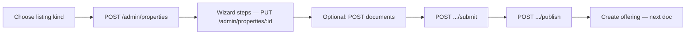

# Frontend implementation guide — admin property wizard

> **Category:** [`docs/frontend/`](../README.md#frontend--admin-integration)  
> **Audience:** Engineers working in **`asset-union-admin`**.  
> **Prerequisite:** [FRONTEND_ADMIN_AUTH.md](./FRONTEND_ADMIN_AUTH.md) — admin login and Bearer token must work first.  
> **Backend status:** Property wizard APIs are live (`Step 6b`).

---

## 1) Scope

Wire these admin screens to the API:

| Screen | Purpose |
| --- | --- |
| `/property-management` | List properties with status + funding stats |
| `/property-management/[id]` | View property detail, approval actions |
| Create listing wizard | Multi-step draft create/save, documents, submit/publish |

**Out of scope for this doc:** offering creation (`/v1/admin/offerings/*`) — separate follow-up after property is published.

---

## 2) Auth & roles

All requests:

```
Authorization: Bearer <adminAccessToken>
Content-Type: application/json
```

Base URL: `{NEXT_PUBLIC_API_URL}` (include `/v1`, e.g. `http://localhost:8000/v1`).

| Role | List | Detail | Create/edit wizard | Submit/publish/reject/pause |
| --- | --- | --- | --- | --- |
| `super_admin` | ✓ | ✓ | ✓ | ✓ |
| `property_manager` | ✓ | ✓ | ✓ | ✓ |
| `rent_manager` | ✓ (read) | ✗ | ✗ | ✗ |
| `user_manager` | ✓ (read) | ✗ | ✗ | ✗ |

Hide wizard and write actions in the UI when the admin lacks `super_admin` or `property_manager`. Server enforces via `403`.

---

## 3) Wizard flow



**Listing kinds** (required on every create/save):

| UI value             | API `listingKind`      | DB `type`      |
| -------------------- | ---------------------- | -------------- |
| Rental property      | `rental-property`      | `rental`       |
| Construction project | `construction-project` | `construction` |

**Section keys per kind** — only send keys valid for the chosen kind:

| `rental-property`          | `construction-project`     |
| -------------------------- | -------------------------- |
| `basicPropertyInformation` | `basicPropertyInformation` |
| `investmentStructure`      | `legalDocumentation`       |
| `rentalEconomics`          | `fundingStructure`         |
| `propertyManagement`       | `constructionTimeline`     |
| `legalOwnership`           | `projectTimeline`          |
| `propertyDescription`      | `propertyDetails`          |

Canonical TypeScript shapes: `packages/schema/src/schema/property-wizard-metadata.ts`.

---

## 4) Endpoints

| Action | Method | Path | Body |
| --- | --- | --- | --- |
| List | `GET` | `/admin/properties?status&limit&offset` | — |
| Detail (reload wizard) | `GET` | `/admin/properties/:id` | — |
| Create draft | `POST` | `/admin/properties` | §5.1 |
| Save step | `PUT` | `/admin/properties/:id` | §5.2 |
| Add document | `POST` | `/admin/properties/:id/documents` | §5.3 |
| Remove document | `DELETE` | `/admin/properties/:id/documents/:documentId` | — |
| Submit for review | `POST` | `/admin/properties/:id/submit` | — |
| Publish | `POST` | `/admin/properties/:id/publish` | — |
| Reject | `POST` | `/admin/properties/:id/reject` | `{ "reason": "..." }` |
| Pause | `POST` | `/admin/properties/:id/pause` | `{ "reason?": "..." }` |
| Resume | `POST` | `/admin/properties/:id/resume` | — |

---

## 5) Request / response shapes

### 5.1 Create draft — `POST /admin/properties`

```json
{
  "listingKind": "rental-property",
  "name": "Luxury Apartment Complex",
  "currentStep": "basicPropertyInformation",
  "sections": {
    "basicPropertyInformation": {
      "propertyName": "Luxury Apartment Complex",
      "city": "Miami",
      "region": "FL",
      "country": "US",
      "shortSummary": "Premium beachfront property",
      "coverImageUrl": "https://example.com/hero.jpg",
      "galleryUrls": ["https://example.com/1.jpg"]
    }
  }
}
```

**201** — property with `status: "draft"`. Store `id` in the wizard route (`/property-management/new` → redirect to `/property-management/[id]/edit`).

### 5.2 Save step — `PUT /admin/properties/:id`

Send **only the section(s) changed** on that step plus `listingKind` and optional `currentStep`:

```json
{
  "listingKind": "rental-property",
  "currentStep": "investmentStructure",
  "sections": {
    "investmentStructure": {
      "propertyPrice": "2500000",
      "sharePrice": "100",
      "totalShares": 25000,
      "minOrderShares": 1,
      "maxOrderShares": 500
    }
  }
}
```

**Deep-merge rules:**

- Backend merges each section object shallowly into existing `metadata.sections`.
- Omitted section keys are left unchanged.
- `listingKind` must match the property’s type (409 `LISTING_KIND_MISMATCH` if not).
- Edits allowed only in `draft` or `submitted` status.

**200** — full property + `metadata` + `documents[]`. Use `metadata.sections` and `metadata.currentStep` to hydrate wizard state on reload.

**Top-level sync:** when `basicPropertyInformation` is saved, backend also updates `name`, `location`, `heroImage`, `gallery` on the property row.

### 5.3 Document — `POST /admin/properties/:id/documents`

Register a file **after** upload (no presigned-url endpoint yet):

```json
{
  "type": "legal",
  "title": "Title deed",
  "url": "https://cdn.example.com/properties/p1/title.pdf",
  "storageKey": "properties/p1/title.pdf",
  "externalUrl": "https://registry.example.com/doc/123",
  "subtitle": "Notarized copy",
  "action": "download"
}
```

`type`, `title`, `url` required. `action`: `chevron` | `open` | `download` (default `chevron`).

**201** — document row. Allowed only while property is `draft` or `submitted`.

### 5.4 List — `GET /admin/properties`

**200:**

```json
{
  "items": [
    {
      "id": "...",
      "propertyName": "Luxury Apartment Complex",
      "location": "Miami, FL, US",
      "currentStage": "Published",
      "manager": "Jane Doe",
      "role": "Property Manager",
      "funding": "125000.00",
      "fundingPercent": 50,
      "type": "rental",
      "date": 1700000000,
      "status": "active"
    }
  ],
  "total": 1
}
```

Query `status`: `draft` | `submitted` | `active` | `rejected` | `paused` | `closed`.

### 5.5 Detail — `GET /admin/properties/:id`

**200** — property fields + `metadata` (wizard state) + `documents[]`. Timestamps are **Unix seconds**.

Reload wizard on mount:

```typescript
const meta = property.metadata as PropertyWizardMetadata;
const sections = meta?.sections ?? {};
const step = meta?.currentStep ?? "basicPropertyInformation";
const listingKind = meta?.listingKind ?? mapTypeToListingKind(property.type);
```

### 5.6 Status transitions

```
draft → submitted → active → paused ⇄ active
                  ↘ rejected      ↘ closed
```

| Endpoint           | From → To                                  |
| ------------------ | ------------------------------------------ |
| `POST .../submit`  | `draft` → `submitted`                      |
| `POST .../publish` | `submitted` → `active`                     |
| `POST .../reject`  | `submitted` → `rejected` (reason required) |
| `POST .../pause`   | `active` → `paused`                        |
| `POST .../resume`  | `paused` → `active`                        |

**200** transition response:

```json
{
  "id": "...",
  "status": "submitted",
  "previousStatus": "draft",
  "timestamp": 1700000000,
  "reason": "optional"
}
```

---

## 6) UI implementation notes

1. **Step 1 (kind picker):** on confirm → `POST /admin/properties` with minimal `basicPropertyInformation` → navigate to edit URL with returned `id`.
2. **Per-step save:** debounce or explicit “Save & continue” → `PUT` with that step’s section only. Always send the same `listingKind`.
3. **Resume draft:** `GET /admin/properties/:id` on load; bind form fields from `metadata.sections[stepKey]`.
4. **Images:** store public URLs in `coverImageUrl` / `galleryUrls`. R2 presign flow is not exposed yet — use placeholder URLs in dev or upload via your own storage integration, then pass the final URL.
5. **Legal docs step:** upload file → get URL → `POST .../documents`. List from `documents` on detail response.
6. **Submit / publish:** call transition endpoints from review screen; disable wizard edits after `active` (409 `PROPERTY_NOT_EDITABLE`).
7. **After publish:** prompt to create an offering for this `propertyId` (next integration).

---

## 7) Errors

All errors: `{ "error": { "code": "...", "message": "...", "details?": "..." } }`

| Code                        | HTTP | UI action                             |
| --------------------------- | ---- | ------------------------------------- |
| `UNAUTHORIZED`              | 401  | Redirect to login / refresh token     |
| `FORBIDDEN`                 | 403  | Show “insufficient permissions”       |
| `VALIDATION_ERROR`          | 400  | Show field/section errors             |
| `INVALID_SECTION_FOR_TYPE`  | 422  | Wrong section for listing kind        |
| `INVALID_SECTION_DATA`      | 422  | Fix fields in current step            |
| `PROPERTY_NOT_FOUND`        | 404  | Back to list                          |
| `PROPERTY_NOT_EDITABLE`     | 409  | Read-only mode; explain status        |
| `LISTING_KIND_MISMATCH`     | 409  | Lock kind after create                |
| `INVALID_STATUS_TRANSITION` | 409  | Refresh status, update action buttons |
| `REASON_REQUIRED`           | 409  | Require rejection reason              |
| `PROPERTY_SLUG_EXISTS`      | 409  | Change property name                  |

---

## 8) TypeScript types (copy to admin app)

Import or mirror from backend schema:

```typescript
export type ListingKind = "construction-project" | "rental-property";

export type PropertyWizardMetadata = {
  wizardVersion: 1;
  listingKind: ListingKind;
  currentStep?: string;
  completedSteps?: string[];
  sections: Record<string, unknown>;
};

export type CreateWizardDraftRequest = {
  listingKind: ListingKind;
  name?: string;
  currentStep?: string;
  sections?: Record<string, unknown>;
};

export type SaveWizardDraftRequest = CreateWizardDraftRequest;

export type PropertyDocumentUploadRequest = {
  type: string;
  title: string;
  url: string;
  storageKey?: string;
  externalUrl?: string;
  subtitle?: string;
  action?: "chevron" | "open" | "download";
};
```

---

## 9) Testing checklist

- [ ] List loads with admin token; filters by `status`
- [ ] Create rental + construction drafts; correct sections accepted/rejected
- [ ] PUT deep-merges without wiping other sections
- [ ] Reload wizard from GET detail restores step + sections
- [ ] Document add/delete while `draft`; blocked when `active`
- [ ] Full lifecycle: draft → submit → publish
- [ ] Reject requires reason; pause/resume on active property
- [ ] `rent_manager` can list but gets 403 on create/edit
- [ ] Postman folder **Admin - Properties** passes against local API

**Local seed:** `pnpm db:migrate && pnpm db:seed` — admin `admin@assetunion.com` / `AdminPassword123!`

---

## 10) Backend reference

| Topic | Path |
| --- | --- |
| Routes | `packages/api/src/http/v1/property/property.routes.ts` |
| DTOs | `packages/api/src/http/v1/property/property.dto.ts` |
| Section validators | `packages/api/src/http/v1/property/property-wizard-validators.ts` |
| Metadata types | `packages/schema/src/schema/property-wizard-metadata.ts` |
| Postman | `postman/Asset_Union_API_Collection.json` → **Admin - Properties** |
| Screen map | `docs/frontend/UI_TO_API_INVENTORY.md` → Property Management |

---

## 11) Agent summary

1. Ensure admin auth works ([FRONTEND_ADMIN_AUTH.md](./FRONTEND_ADMIN_AUTH.md)).
2. List page → `GET /admin/properties`.
3. New wizard → `POST /admin/properties` → edit route with `id`.
4. Each step → `PUT /admin/properties/:id` with partial `sections`.
5. Documents → `POST/DELETE .../documents` with URLs.
6. Review → submit → publish; then integrate offerings.

**Done when:** Admin can create, save, reload, and publish a property through the wizard against the live API.
